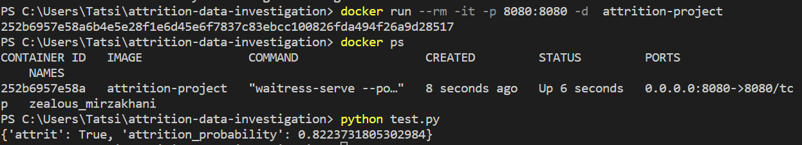

This is a midterm project at ML-Zoomcamp-2022 course. It is aimed to solve the employees attrition problem at the company. Model used here makes prediction of attrition of valuable employees. 

This project uses a fictional [dataset of employees attrition](https://www.kaggle.com/datasets/whenamancodes/hr-employee-attrition) created by IBM data scientists.

You can download the dataset from [Kaggle](https://www.kaggle.com/datasets/whenamancodes/hr-employee-attrition) or from the [project folder](https://github.com/tanyashagova/ML-Zoomcamp-2022/blob/main/midtermproject/HR%20Employee%20Attrition.csv) on GitHub.


## Description

Project folder contains

* Data 
* Notebook (`notebook.ipynb`) with data preparation, EDA, feature importance analysis and model selection process
* Script `train.py` which contains  training and saving the final model
* File `model.bin` with final model and dictvectorizer
* Script `predict.py` with model loading and serving it via a web serice (with Flask)
* `Pipenv` and `Pipenv.lock` files with dependencies
* `Dockerfile` for running the service
* Script `test.py` with test prediction for data of given person 


## Usage

1. Build an image from a Dockerfile by running following command:
```sh
docker build -t attrition-project .
```
2. Run service by command:
```sh
docker run --rm -it -p 8080:8080 -d  attrition-project
```
3. Run test.py to see attrition prediction on given data.

After that you will see following:



4. Try to change different parameters in record from test.py and see attrition result.